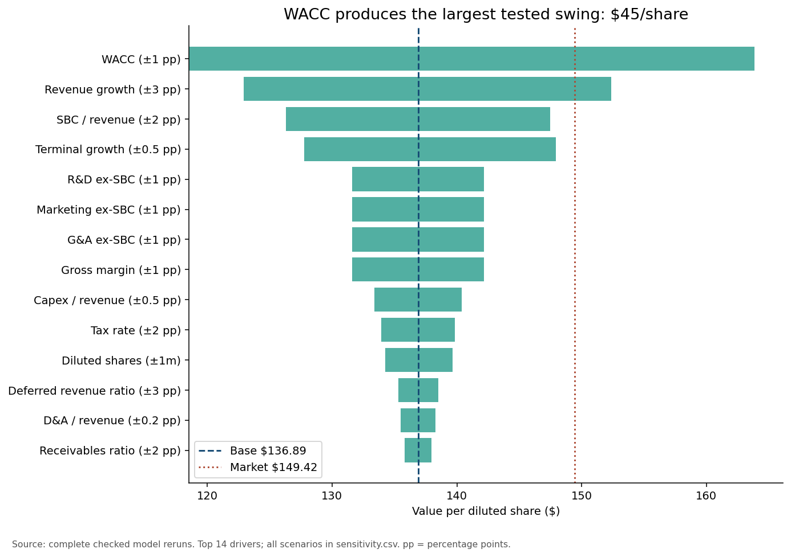

# DUOL — colleague briefing

**$136.89 base vs $149.42 market; 8.28% WACC, 3% terminal growth.** Growth, WACC and SBC carry the sensitivity ranking. Wait for evidence of revenue reacceleration and margin expansion; rebuild if the filing-based triggers in the summary occur.

## Forecast and checks

|      Year |   Revenue $m |   EBIT margin |   SBC/revenue |   Capex $m |   Cash $m |
|----------:|-------------:|--------------:|--------------:|-----------:|----------:|
| 2026.0000 |    1207.0000 |        0.1010 |        0.1500 |    31.8725 | 1287.5735 |
| 2027.0000 |    1424.2600 |        0.1300 |        0.1400 |    37.6096 | 1658.6412 |
| 2028.0000 |    1652.1416 |        0.1650 |        0.1300 |    43.6271 | 2119.8231 |
| 2029.0000 |    1866.9200 |        0.2000 |        0.1200 |    49.2987 | 2674.2510 |
| 2030.0000 |    2053.6120 |        0.2250 |        0.1100 |    54.2285 | 3307.3851 |

**120/120 required checks PASS.** Cash reconciles and every balance sheet balances. See [labelled assumptions](assumptions.csv), [seven rates](outputs/tables/seven_discount_rates.csv), [shock table](outputs/tables/sensitivity.csv), [named cases](outputs/tables/named_cases.csv), and [market-implied conditions](outputs/tables/market_implied.csv).

## Locked agent predictions reconciled

Before running: +1 point gross margin was predicted to add roughly $5–10/share; actual change is $5.29. +1 point WACC was predicted to subtract $10–20/share; actual change is $-18.37. Both directions and rough ranges were correct. These predictions were written by the agent, not by a student/partner.

## Eight numerical answers

**Why this discount rate?**

WACC 8.28% = 4.75% + 0.852 × 4.14%, with zero traditional debt. The beta standard error is 0.515; the seven-rate table is essential.

**Is terminal value the whole answer?**

84.3% of EV is terminal. The 20% incremental-ROIC terminal alternative gives $125.32/share versus $136.89 in the base.

**Why forecast less growth than history?**

FY2025 revenue grew 38.7%; management now guides to $1,207m revenue in 2026. The 2027 assumption of 18% is explicitly judgment.

**What is DUOL’s special balance-sheet line?**

Deferred revenue was $496.205m at FY2025 and $505.102m at June 2026. Customer prepayments finance operations; deferred payment-processing costs are offsetting operating assets.

**What does the market comparison mean?**

The $149.42 close exceeds the $136.89 base. Holding other inputs fixed, WACC 7.76% would reconcile the two; it is a model condition, not observed investor belief.

**What would change the case?**

Gross margin below 70.6%, SBC above 17% of revenue, or growth 3 points below the path triggers a rebuild, with the computed values above.

**Why FCFF rather than the ABG FCFE?**

DUOL has $0 traditional debt; FCFF at WACC avoids importing auto-dealer floor-plan borrowing. $100m cash is retained and only estimated excess liquidity is added.

**Why not just use provider free cash flow?**

FY2025 reported FCF was $360.424m, including $137.437m SBC in CFO and interest income. Our operating FCFF retains compensation expense and removes non-operating interest.

## Simulated sceptic questions (not a human peer assessment)

1. **Does keeping SBC in expenses and using 50.7m shares overstate dilution?** It is conservative: the count includes existing awards and no further annual dilution factor is imposed. A precise award valuation would separate existing grants from future employee compensation.
2. **Why does the terminal reinvestment imply 101% ROIC?** Deferred revenue growth offsets much of capex net of D&A, while R&D is expensed. The explicit 20% and 30% alternatives quantify the weaker-reinvestment-economics case.
3. **Are September cash balances observed?** No. June cash of $1,180.887m is filed; $15.135m elapsed-period economic cash is a uniform-accrual estimate. This is isolated in the bridge and assumptions.

## Driver panel record

The same model powers `python duol_valuation/panel.py`. Its gross-margin +1 point move computes $142.18/share with all checks passing; the base is $136.89. The automated HTTP smoke-test record is in outputs/tables/panel_smoke_test.json.

Review triggers: gross margin <70.6%; revenue growth 3 points below path; SBC >17% of revenue. Rebuild from the next two filings if confirmed. Full limitations: [valuation summary](valuation_summary.md).

Learning exercise, not investment research or financial advice.
